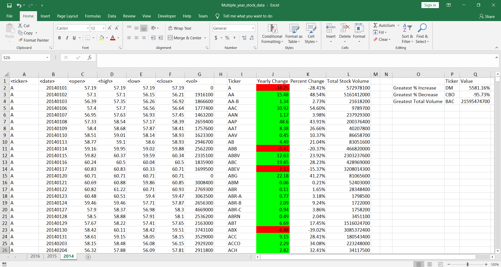
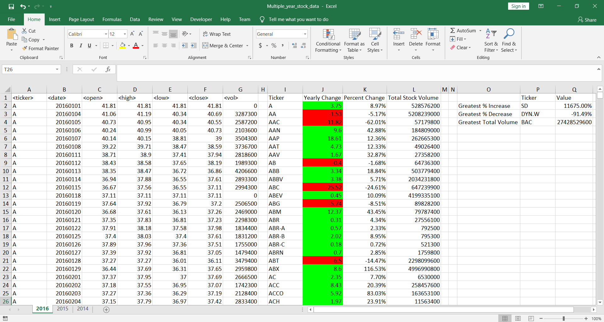

In this project, VBA was used to analyze stock market prices during 2014-2016.

## VBA Code

``` VBA

Sub StockAnalysis()

    ' Declare variables for stock information
    Dim Stock_Name As String
    Dim Yearly_Change, Initial_Open As Double
    Dim Percent_Change As Double
    Dim Total_Stock_Volume As LongLong
    Dim Stock_Ticker_Row As Integer
    
    ' Declare variables for summary values
    Dim Greatest_Percent_Increase_Ticker As String
    Dim Greatest_Percent_Increase As Double
    Dim Greatest_Percent_Decrease_Ticker As String
    Dim Greatest_Percent_Decrease As Double
    Dim Greatest_Total_Volume_Ticker As String
    Dim Greatest_Total_Volume As LongLong
    
    For Each ws In Worksheets
    
        ' Determine the last row
        LastRow = ws.Cells(Rows.Count, 1).End(xlUp).Row
        
        'Create headers for ticker, yearly change, percent change, and total stock volume
        ws.Cells(1, 9).Value = "Ticker"
        ws.Cells(1, 10).Value = "Yearly Change"
        ws.Cells(1, 11).Value = "Percent Change"
        ws.Cells(1, 12).Value = "Total Stock Volume"

        ' Assign initial variables
        Yearly_Change = 0
        Initial_Open = ws.Cells(2, 3).Value
        Percent_Change = 0
        Total_Stock_Volume = 0
        
        ' Keep track of the location of each stock ticker in ticker column
        Stock_Ticker_Row = 2
        
        ' Create summary headers
        ws.Cells(2, 15).Value = "Greatest % Increase"
        ws.Cells(3, 15).Value = "Greatest % Decrease"
        ws.Cells(4, 15).Value = "Greatest Total Volume"
        ws.Cells(1, 16).Value = "Ticker"
        ws.Cells(1, 17).Value = "Value"

        ' Determine the last row for the ticker summary columns
        LastRowSummary = ws.Cells(Rows.Count, 9).End(xlUp).Row

        ' Loop through year of stock data
        For i = 2 To LastRow
        
            'Check if stock ticker changes when moving to the next row
            If ws.Cells(i + 1, 1).Value <> ws.Cells(i, 1).Value Then
          
                ' Set stock name
                Stock_Name = ws.Cells(i, 1).Value
                
                ' Add stock volume to total stock volume
                Total_Stock_Volume = Total_Stock_Volume + ws.Cells(i, 7).Value
                
                ' Subtract final close to initial open to get yearly change
                Yearly_Change = ws.Cells(i, 6).Value - Initial_Open
     
                ' Calculate percent change
                
                ' Avoid "divide by 0" error
                If Initial_Open = 0 Then
                
                    Percent_Change = 0
                
                Else
                               
                    ' Perform percent change calculation
                    Percent_Change = Yearly_Change / Initial_Open
                
                End If
                
                ' Print stock ticker name in ticker column
                ws.Range("I" & Stock_Ticker_Row).Value = Stock_Name
                
                ' Print yearly change in yearly change column
                ws.Range("J" & Stock_Ticker_Row).Value = Yearly_Change
                
                ' Conditional formatting for yearly change
                If Yearly_Change < 0 Then
                    
                    ' Make interior color red
                    ws.Range("J" & Stock_Ticker_Row).Interior.ColorIndex = 3
                
                ElseIf Yearly_Change > 0 Then
                    
                    ' Make interior color green
                    ws.Range("J" & Stock_Ticker_Row).Interior.ColorIndex = 4
                    
                Else
                    ' Make interior color clear
                    ws.Range("J" & Stock_Ticker_Row).Interior.ColorIndex = 0
                
                End If
                
                ' Print percent change to percent change column
                ws.Range("K" & Stock_Ticker_Row).Value = Format(Percent_Change, "Percent")
                
                ' Print stock volume amount to the stock volume column
                ws.Range("L" & Stock_Ticker_Row).Value = Total_Stock_Volume
                
                ' Add increment (1) to stock ticker row
                Stock_Ticker_Row = Stock_Ticker_Row + 1
                
                ' Reset total stock volume
                Total_Stock_Volume = 0
                
                ' Reset initial open
                Initial_Open = ws.Cells(i + 1, 3).Value
            
            Else
            
                ' If cell immediately following row is the same stock ticker then just add stock volume to total stock volume
                Total_Stock_Volume = Total_Stock_Volume + ws.Cells(i, 7).Value
                
            End If
                
        Next i

        ' Get values for greatest percent increase, greatest percent decrease, and greatest total volume
        Greatest_Percent_Increase = WorksheetFunction.Max((Range(ws.Cells(2, 11), ws.Cells(LastRowSummary, 11))))
        Greatest_Percent_Decrease = WorksheetFunction.Min((Range(ws.Cells(2, 11), ws.Cells(LastRowSummary, 11))))
        Greatest_Total_Volume = WorksheetFunction.Max((Range(ws.Cells(2, 12), ws.Cells(LastRowSummary, 12))))
    
        ' Loop through summary table to match values with tickers
        For i = 2 To LastRowSummary
        
            ' Find stock ticker with greatest percent increase and assign to greatest percent increase ticker variable
            If ws.Cells(i, 11).Value = Greatest_Percent_Increase Then
            
                If Greatest_Percent_Increase_Ticker = "" Then
                    
                    Greatest_Percent_Increase_Ticker = ws.Cells(i, 9).Value
                
                Else
                    
                    Greatest_Percent_Increase_Ticker = Greatest_Percent_Increase_Ticker & ", " & ws.Cells(i, 9).Value
                
                End If
            
            End If
            
            ' Find stock ticker with greatest percent decrease and assign to greatest percent decrease ticker variable
            If ws.Cells(i, 11).Value = Greatest_Percent_Decrease Then

                If Greatest_Percent_Decrease_Ticker = "" Then
                    
                    Greatest_Percent_Decrease_Ticker = ws.Cells(i, 9).Value

                Else
                    
                    Greatest_Percent_Decrease_Ticker = Greatest_Percent_Decrease_Ticker & ", " & ws.Cells(i, 9).Value
                    
                End If
                
            End If

            ' Find stock ticker with greatest total volume and assign to greatest total stock volume ticker variable
            If ws.Cells(i, 12).Value = Greatest_Total_Volume Then
            
                If Greatest_Total_Volume_Ticker = "" Then
                
                    Greatest_Total_Volume_Ticker = ws.Cells(i, 9).Value
                    
                Else
                
                    Greatest_Total_Volume_Ticker = Greatest_Total_Volume_Ticker & ", " & ws.Cells(i, 9).Value
                    
                End If

            End If

        Next i

        ' Print values to summary table
        ws.Cells(2, 16).Value = Greatest_Percent_Increase_Ticker
        ws.Cells(3, 16).Value = Greatest_Percent_Decrease_Ticker
        ws.Cells(4, 16).Value = Greatest_Total_Volume_Ticker
        ws.Cells(2, 17).Value = Format(Greatest_Percent_Increase, "Percent")
        ws.Cells(3, 17).Value = Format(Greatest_Percent_Decrease, "Percent")
        ws.Cells(4, 17).Value = Greatest_Total_Volume

        ' Reset ticker values
        Greatest_Percent_Increase_Ticker = ""
        Greatest_Percent_Decrease_Ticker = ""
        Greatest_Total_Volume_Ticker = ""

    Next ws

End Sub

```

## 2014 Stock Market Analysis

In 2014, DM had the greatest % increase (5581.16%), and CBO had the greatest % decrease (-95.73%). BAC had the greatest total 
volume (21595474700).



## 2015 Stock Market Analysis

In 2015, ARR had the greatest % increase (491.30%), and KMI.W had the greatest % decrease (-98.59%). BAC had the greatest total 
volume (21277761900).


## 2016 Stock Market Analysis

In 2016, SD had the greatest % increase (11675.00%), and DYN.W had the greatest % decrease (-91.49%). BAC had the greatest total 
volume (27428529600).

